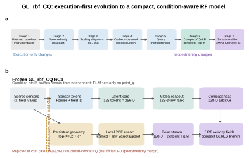
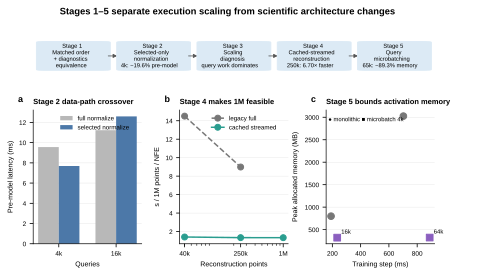
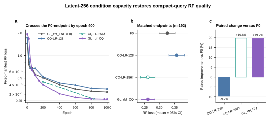
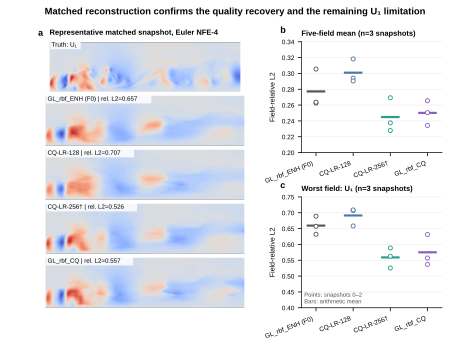
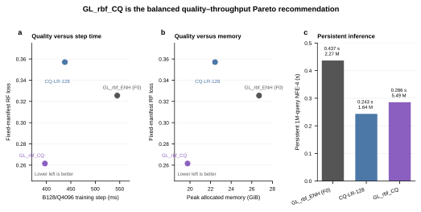

# GL_rbf_CQ model update

Release candidate: `GL_rbf_CQ v0.9.0-rc1`  
Frozen internal backbone identifier: `GL_rbf_ENH_CQ`  
Scope: PointCloud Flow Matching for sparse multi-field turbulent-combustion reconstruction

## Contents

- [1. Executive summary](#1-executive-summary)
- [2. The original PointCloud FFM and GL_rbf_ENH](#2-the-original-pointcloud-ffm-and-gl_rbf_enh)
- [3. Mathematical model](#3-mathematical-model)
- [4. Stage 1 — matched execution baseline](#4-stage-1--matched-execution-baseline)
- [5. Stage 2 — selected materialization](#5-stage-2--selected-materialization)
- [6. Stage 3 — explicit scaling characterization](#6-stage-3--explicit-scaling-characterization)
- [7. Stage 4 — cached-streamed reconstruction](#7-stage-4--cached-streamed-reconstruction)
- [8. Stage 5 — query-microbatch RF training](#8-stage-5--query-microbatch-rf-training)
- [9. Stage 6 — compact query decoding and persistent Top-K](#9-stage-6--compact-query-decoding-and-persistent-top-k)
- [10. Stage 7 — smart conditioning and the final GL_rbf_CQ](#10-stage-7--smart-conditioning-and-the-final-gl_rbf_cq)
- [11. Accepted and rejected decisions](#11-accepted-and-rejected-decisions)
- [12. Quality and throughput evidence](#12-quality-and-throughput-evidence)
- [13. Checkpoint inventory](#13-checkpoint-inventory)
- [14. Public configuration presets](#14-public-configuration-presets)
- [15. Compatibility, limitations, and intended use](#15-compatibility-limitations-and-intended-use)
- [16. Reproducibility map](#16-reproducibility-map)

## 1. Executive summary

`GL_rbf_CQ` is the release-candidate form of the PointCloud FFM model. It keeps
the proven sparse-sensor, latent-attention, local RBF, GLRES, random-feature
flow-matching, KeOps, and persistent Top-K machinery, while making two focused
changes:

1. the query decoder remains compact at 128 dimensions with four-head rank-64
   low-rank readout and additive fusion; and
2. the *condition representation and RF training* become stronger through a
   256-D latent core, trainable-parameter EMA, zero-initialized sinusoidal
   timestep FiLM, and a raw RBF measurement/support shortcut.

The selected epoch-1000 model improves the controlled fixed-manifest RF loss
from `0.325531` for `GL_rbf_ENH` (F0) to `0.261507`, a paired `19.7%`
improvement. On the same RTX 6000 Ada B128/Q4096 protocol it reduces the step
from `544.84 ms` to `397.06 ms` (`1.37×`) and peak allocated memory from
`27,346 MiB` to `20,239 MiB` (`26.0%`). Persistent one-million-query Euler
NFE-4 inference falls from `0.4367 s` to `0.2857 s` (`1.53×`).

The public recommendation is therefore:

- **`GL_rbf_CQ`** for balanced quality and throughput;
- **`GL_rbf_CQ-fast`** for latency-first CQ-LR-128 use where the validated
  quality penalty is acceptable; and
- **`GL_rbf_ENH`** only as the legacy/reference profile.



## 2. The original PointCloud FFM and GL_rbf_ENH

The original PointCloud FFM maps a sparse, field-labelled sensor set and a set
of query coordinates to a multi-field rectified-flow velocity. For a condition
set

\[
\mathcal C=\{(\mathbf s_j,f_j,y_j,m_j)\}_{j=1}^{M},
\]

the model embeds sensor coordinates, the scalar measurement, the field ID, and
the validity mask. A learned latent array summarizes the unordered sensor set;
query coordinates then receive three complementary streams:

- a point/query encoding;
- a global condition/readout stream from the latent representation; and
- a local RBF interpolation stream over the nearest sensors.

`GL_rbf_ENH` (the Stage 6 F0 reference) is the high-quality historical version.
Its decoder concatenates broad point, global, and local representations before
the field head. That capacity is effective, but query-side activations dominate
cost as query count and batch size increase. The entire Stage 1–5 program was
designed to make this model measurable and streamable without changing its
scientific mapping; Stage 6 then isolated the query decoder as the architectural
bottleneck.

The frozen implementation remains in `src/Model.py` for checkpoint
compatibility:

- `ConditionalPointHybridLocalGlobalRBF` begins near line 716;
- `ConditionalPointHybridLocalGlobalRBFCQ` begins near line 1892; and
- `PointCloudFFM` begins near line 2983.

The public name `GL_rbf_CQ` is documentation-level in RC1. Renaming internal
classes or checkpoint keys is intentionally deferred.

## 3. Mathematical model

### 3.1 Rectified-flow bridge and objective

Training samples a clean normalized field vector \(\mathbf x_1\), a random
prior field \(\mathbf x_0\), and \(t\sim\mathcal U[0,1]\). The straight bridge
and target velocity are

\[
\mathbf x_t=(1-t)\mathbf x_0+t\mathbf x_1,
\qquad
\mathbf u^*=\frac{d\mathbf x_t}{dt}=\mathbf x_1-\mathbf x_0.
\]

For query coordinates \(\mathbf q\) and condition \(\mathcal C\), the model
predicts \(\mathbf v_\theta(\mathbf x_t,t,\mathbf q,\mathcal C)\) and minimizes

\[
\mathcal L_{\mathrm{RF}}
=\mathbb E\left[
\frac{1}{QF}\sum_{i=1}^{Q}\sum_{f=1}^{F}
\left(v_{\theta,i,f}-u^*_{i,f}\right)^2
\right].
\]

The prior is the existing random Fourier feature field (`prior: rff`, 256
features, length scale 0.15). Stage 7 does not alter this bridge, target, prior,
or objective.

### 3.2 Sparse sensor tokens and latent core

For valid sensor \(j\), the input token can be summarized as

\[
\mathbf z_j=\phi_{\mathrm{in}}\left[
\gamma(\mathbf s_j),\; y_j,\; \mathbf e_{f_j},\;m_j
\right],
\]

where \(\gamma\) is the Fourier coordinate encoding and \(\mathbf e_{f_j}\)
is a learned field embedding. Learned latent tokens cross-attend to the sensor
tokens and pass through four latent self-attention/MLP blocks. Sensor
re-injection remains active once per block. A reverse sensor-to-latent readout
produces the sensor features used by the local stream.

The Stage 7 default raises only the condition latent width from 128 to 256. It
does **not** increase the 128 latent-token count or the four-block depth, and it
does **not** widen the 128-D query decoder.

### 3.3 Local RBF and GLRES weighting

For query \(i\), one Top-K search yields sensor indices \(\mathcal N_K(i)\) and
squared distances \(d_{ij}^2\). With learnable positive scale \(\sigma\), the
local learned-feature logits are

\[
\ell_{ij}=-\frac{d_{ij}^2}{2\sigma^2+\varepsilon}
+\alpha\,a_j,
\qquad
w_{ij}=\operatorname{softmax}_{j\in\mathcal N_K(i)}(\ell_{ij}),
\]

where \(a_j\) is the GLRES sensor-importance term and \(\alpha\) is its learned
scale. The local learned condition is

\[
\mathbf h_i^{\mathrm{local}}
=\sum_{j\in\mathcal N_K(i)}w_{ij}\mathbf h_j^{\mathrm{sensor}}.
\]

The RC uses `K=32`, KeOps, learned sigma, and `topk_rbf_glres`. These choices are
unchanged from the validated CQ-LR reference.

### 3.4 Compact low-rank query readout

`GL_rbf_CQ` retains the CQ-LR decoder:

- query state width \(d_q=128\);
- low-rank readout rank \(r=64\);
- four readout heads; and
- additive fusion.

Schematically, the compact query state is

\[
\mathbf h_i=mathbf p_i
+\lambda_g\mathbf g_i
+\lambda_l\mathbf l_i
+\lambda_r\mathbf r_i,
\]

where \(\mathbf p_i\) is the point state, \(\mathbf g_i\) the global stream,
\(\mathbf l_i\) the projected local RBF stream, and \(\mathbf r_i\) the low-rank
coordinate-conditioned latent readout. The decoder and compact GLRES coarse
branch then predict the five RF velocity fields. Stage 7 strengthens what is
encoded into these compact streams rather than restoring the wide F0 head.

### 3.5 Sinusoidal timestep FiLM

Historical checkpoints use the scalar timestep input. When the Stage 7 option
is enabled, sinusoidal frequencies form

\[
\gamma_t(t)=\left[
\sin(t\omega_0),\cos(t\omega_0),\ldots,
\sin(t\omega_{d/2-1}),\cos(t\omega_{d/2-1})
\right],
\]

followed by an MLP and a projection to scale/shift pairs. Only the point state
is modulated:

\[
\widetilde{\mathbf p}_i
=\mathbf p_i\odot(1+\mathbf a(t))+\mathbf b(t).
\]

The final FiLM projection is zero-initialized, so enabling the module initially
implements the identity exactly. Condition latents, persistent geometry, and
query-static caches remain time independent.

### 3.6 Explicit raw measurement/support shortcut

Stage 7 uses the *same* Top-K indices and distances as the learned local stream.
No second KNN is permitted. For field \(f\), raw distance-only RBF weights
\(\rho_{ij}\) produce

\[
s_{i,f}=\sum_{j\in\mathcal N_K(i)}\rho_{ij}\,\mathbb 1[f_j=f],
\]

\[
\widehat y_{i,f}=
\frac{\sum_{j\in\mathcal N_K(i)}
\rho_{ij}\,\mathbb 1[f_j=f],y_j}
{s_{i,f}+\varepsilon}.
\]

For five fields, `[measurement, support]` contributes only ten explicit scalar
features per query. The raw weights exclude learned GLRES importance so that
the shortcut retains a direct measurement interpretation. The feature pair is
concatenated only when enabled; the disabled head is bitwise the historical CQ
shape.

### 3.7 Model EMA

For trainable parameter \(\theta\), EMA follows

\[
\bar\theta_k=\beta\bar\theta_{k-1}+(1-\beta)\theta_k,
\qquad \beta=0.999.
\]

Frozen parameters and buffers are copied exactly rather than averaged. Both live
and EMA state are checkpointed and resumable. The RC loader also repairs the
earlier Stage 7 research checkpoints by taking EMA trainable values and live
frozen values, preventing RF-prior drift.

## 4. Stage 1 — matched execution baseline

Stage 1 established a controlled legacy-versus-optimized baseline before any
scientific architecture comparison. The optimized path introduced scalable CPU
index sampling, shared-mesh coordinates, selected GPU transfer, diagnostic
phase timing, and fixed-manifest RF evaluation. The model mathematics and
checkpoint semantics were held constant.

The most important outcome was methodological: data-order effects, random RF
draws, and sparse sensor layouts became explicit rather than being confounded
with runtime changes. This allowed later speedups to be accepted only after
matched loss/checkpoint checks.

## 5. Stage 2 — selected materialization

Stage 2 removed unnecessary field normalization and GPU materialization for the
active 4,096-query workload. On the real 40,300-point dataset, selected
normalization reduced pre-model latency from `9.559 ms` to `7.688 ms` at 4k
queries (`19.6%`). The 16k case exposed a crossover (`11.226 ms` full versus
`12.592 ms` selected), which is why the optimization remained workload-aware
rather than being claimed as universally faster.

No learned mapping changed. This is an execution-only stage.

## 6. Stage 3 — explicit scaling characterization

Stage 3 separated full-mesh data cost, selected-query cost, observation count,
and model-query cost. Key results were:

- holding 4,096 selected queries fixed while increasing the host mesh from
  40.3k to 1M changed selected GPU input by essentially zero (`0.582 MiB`);
- pre-model latency remained tens of milliseconds (`17.99–24.44 ms`);
- model step time grew from roughly `61 ms` at 4k to `713 ms` at 65k for 256
  observations; and
- model peak allocation grew from `255 MiB` to `3,023 MiB`.

This established query activations—not full-mesh I/O—as the primary scaling
target and motivated streaming inference plus microbatched training.

## 7. Stage 4 — cached-streamed reconstruction

Stage 4 split reconstruction into reusable condition context, query-static
cache, and per-NFE dynamic state. Cached-streamed execution constructs the
condition representation once, materializes static query features in chunks,
and evaluates Euler/Heun dynamics without retaining a full dynamic hidden
tensor.

At 250k points it was `6.70×` faster than legacy-full reconstruction and used
`69.4%` less process-local peak allocation. One-million-query Euler NFE-2
completed in `2.675 s` with a `2,958 MiB` peak. The explicit static cache was
the main memory term, not a hidden full-query activation.

The deterministic matrix covered gather modes, solvers, NFE counts,
observation-consistency modes, and cache levels. All 21 focused tests passed;
the real-snapshot cached-versus-legacy maximum absolute difference was
`3.10e-6`, with identical reported relative L2.

## 8. Stage 5 — query-microbatch RF training

Stage 5 creates the RF bridge, prior draw, condition context, and reduction
denominator once, then splits only query execution. If chunk \(c\) contains
\(n_c\) scalar field elements, the exact global loss is accumulated as

\[
\mathcal L=\frac{\sum_c\sum_{k=1}^{n_c}\ell_{c,k}}{\sum_c n_c}.
\]

This weighting is essential for a short final chunk. The condition graph is
retained across chunks and the same RF prior call spans the full coordinate set.

At 65,536 effective queries, a 4,096-query execution microbatch reduced peak
allocation from `3,025.9 MiB` to `323.7 MiB` (`89.3%`) for a `26.5%` step-time
cost. A deterministic odd-sized 31-query test checked loss, every gradient,
learned RBF sigma, clipped Adam update, validation, and exactly one prior call.

Stages 1–5 are summarized below. They are execution revisions of the same
scientific model, not five separately trained architectures.



## 9. Stage 6 — compact query decoding and persistent Top-K

Stage 6 introduced `GL_rbf_ENH_CQ` as the internal CQ backbone. The sensor,
latent, RBF, sigma, KeOps, GLRES, RF objective, and data protocol were retained;
the query-side representation was compressed to 128 dimensions. The accepted
throughput model used low-rank rank-64/four-head readout and additive fusion.

In the clean 1000-epoch comparison, CQ-LR-128 was roughly `1.24×` faster and
used `16.0%` less peak memory than F0, but its controlled RF loss was `9.7%`
worse. This showed that the efficiency hypothesis was valid while the condition
capacity/training signal was insufficient.

Stage 6 also made geometry-only Top-K persistent. The cache stores the 32
indices and squared distances for each query. Repeated reconstruction uses the
same geometry for all NFE steps; `static_features` can additionally cache
coordinate, local, readout, and raw-support features. Correctness tests assert
zero KNN calls after cache construction. One-million-query geometry occupies
about `396.7 MiB` and is shared across model variants.

The structured-concat rescue (192-D, then the single allowed 224-D fallback)
failed before training. At B128/Q4096, the 192-D model achieved only `1.015×`
speedup and `4.17%` allocated-memory reduction versus F0, missing the required
`1.15×`/`10%` gate. The 224-D fallback was slower than F0. These were valid
negative results, not incomplete training runs.

## 10. Stage 7 — smart conditioning and the final GL_rbf_CQ

Stage 7 tested one coherent principle: keep the query decoder cheap while making
condition representation and RF training smarter. Four YAML-controlled features
were implemented independently and default to disabled/historical behavior:

1. live-plus-EMA checkpointing and EMA evaluation;
2. latent core width 128 or 256 independent of the fixed query width;
3. CQ-only sinusoidal timestep FiLM on `point_q`; and
4. raw per-field RBF measurement and support from the existing Top-K result.

The 200-epoch screen compared Cond128 (S7-A) and All256 (S7-B) under the same
clean protocol. S7-B reached `0.40710` controlled RF loss versus `0.50517` for
F0 and `0.49926` for S7-A, so only S7-B continued. At epoch 1000 it reached
`0.261507`; the first recorded milestone below the F0 endpoint was epoch 400.

The complete regression suite after the EMA correction was **142 passed,
1 skipped**. Tests cover historical loading, EMA round-trip/resume, FiLM
identity and gradients, cached/microbatched execution, raw measurement/support
hand calculations, latent 128/256, persistent geometry, zero-extra-KNN, and
monolithic-versus-query-microbatch equivalence.



## 11. Accepted and rejected decisions

| Decision | Status | Evidence and reason |
|---|---|---|
| Optimized selected-only data path | Accepted | Faster at the primary 4k workload; explicit crossover documented. |
| Cached-streamed inference | Accepted | 6.70× at 250k, 69.4% lower peak, numerical equivalence validated. |
| Query-microbatch training | Accepted | Bounded memory with matched loss/gradient/update tests. |
| CQ-LR-128 decoder | Accepted | Strong efficiency; retained as fast preset and Stage 7 query head. |
| Persistent geometry-only Top-K | Accepted and frozen | Zero post-build KNN, matched cached/non-cached output, shared 1M cache cost. |
| Structured-concat 192-D | Rejected before training | Failed mandatory B128/Q4096 speed and memory gates. |
| Structured-concat 224-D fallback | Rejected before training | Slower than F0 and missed memory gate. No larger sweep opened. |
| Stage 7 Cond128 | Rejected as default | Fast, but did not show a clear quality improvement over F0 at epoch 200. |
| Stage 7 All256 | Accepted as `GL_rbf_CQ` | Best balanced quality/cost point; exact e1000 milestone selected. |
| Explicit SDPA attention rewrite | Rejected as default | Numerical parity passed, but it was 0.7% slower than current MHA-mask execution. |
| Fused AdamW | Optional only | 1.8% step improvement and one-step parity; not mixed into scientific comparison. |
| Senseiver / Latent FM modification | Out of scope | Kept as reference baselines with different inference semantics. |

## 12. Quality and throughput evidence

### 12.1 Controlled RF quality

The fixed manifest contains 64 validation layouts and three RF repeats
(`n=192` paired rows), RF seed 1729. The exact epoch-1000 comparison is:

| Candidate | RF mean | Change versus F0 | Paired-difference 95% CI |
|---|---:|---:|---:|
| `GL_rbf_ENH` / F0 | 0.325531 | reference | 0 |
| CQ-LR-128 | 0.357043 | 9.7% worse | [0.02641, 0.03662] |
| CQ-LR-256 best e840† | 0.261010 | 19.8% better | [-0.07203, -0.05701] |
| **`GL_rbf_CQ` e1000** | **0.261507** | **19.7% better** | **[-0.07159, -0.05646]** |

† Partial clean run; useful quality reference but not a completed formal cost
candidate.

### 12.2 Matched reconstruction

The original fixed-snapshot diagnostic uses one validation snapshot, 256
temperature sensors, observation seed 42, RF seed 1729, identical prior state,
and Euler NFE-1/2/4. At NFE-4, `GL_rbf_CQ` improves the five-field mean from
`0.262493` (F0) to `0.234270`; worst-field U₁ improves from `0.657136` to
`0.557029`.

The RC documentation adds two more deterministic validation snapshots with the
same per-snapshot protocol. Across snapshots 0–2 at NFE-4:

| Candidate | Five-field mean | U₁ mean |
|---|---:|---:|
| F0 | 0.277208 | 0.659442 |
| CQ-LR-128 | 0.300908 | 0.691447 |
| CQ-LR-256† | **0.244889** | **0.558932** |
| **`GL_rbf_CQ`** | **0.250089** | **0.575107** |

These three snapshots are a robustness illustration, not a dataset-wide
confidence interval. They preserve the same ranking and identify U₁ as the
remaining limitation.



### 12.3 Formal cost and Pareto position

Same RTX 6000 Ada, B128/Q4096, exact-gradient 2048-query execution microbatch:

| Candidate | Step | Speedup | Peak allocated | Reduction | 1M/NFE-4 | Speedup |
|---|---:|---:|---:|---:|---:|---:|
| F0 | 544.84 ms | 1.00× | 27,346 MiB | 0.0% | 0.4367 s | 1.00× |
| `GL_rbf_CQ-fast` / CQ-LR-128 | 437.81 ms | 1.24× | 22,973 MiB | 16.0% | **0.2433 s** | **1.79×** |
| **`GL_rbf_CQ`** | **397.06 ms** | **1.37×** | **20,239 MiB** | **26.0%** | **0.2857 s** | **1.53×** |

F0 is dominated under this protocol. `GL_rbf_CQ-fast` remains the minimum
latency point, while `GL_rbf_CQ` is the balanced quality-throughput point.



## 13. Checkpoint inventory

The full byte count, SHA-256 digest, EMA semantics, source lineage, and copy
verification are in `_CheckNotes/GL_rbf_CQ_rc1_artifacts.md`.

| Role | Stable path | Selection |
|---|---|---|
| Recommended exact milestone | `ReleaseArtifacts/GL_rbf_CQ_rc1/GL_rbf_CQ_v0.9.0-rc1_e1000_research.pt` | epoch 1000, EMA trainable + live frozen state |
| Best-validation companion | `ReleaseArtifacts/GL_rbf_CQ_rc1/GL_rbf_CQ_v0.9.0-rc1_best_e965_research.pt` | epoch 965, EMA trainable + live frozen state |
| Training YAML | `ReleaseArtifacts/GL_rbf_CQ_rc1/run_config_training.yaml` | exact historical run configuration |
| Normalization statistics | `ReleaseArtifacts/GL_rbf_CQ_rc1/dataset_stats.pt` | mean/std dictionary |
| F0 reference | `_CheckNotes/Stage6_clean_ab/runs/F0_ENH_1K_B128_DemoN9510_20260821_235104/` | completed 1000 epochs |
| CQ-LR-128 fast reference | `_CheckNotes/Stage6_clean_ab/runs/CQ_LR_1K_B128_DemoN9511_20260821_235104/` | completed 1000 epochs |
| CQ-LR-256 partial reference | `_CheckNotes/Stage6_clean_ab/runs/CQ_LR_L256_1K_B128_DemoN9561_20260822_144624/` | partial; best e840 |

The RC files are research checkpoints with live and EMA state, not yet
single-state deployment exports. They are locally stable but intentionally
ignored by Git. A portable binary distribution mechanism is a cleanup/release
task, not part of this freeze.

## 14. Public configuration presets

### 14.1 `GL_rbf_CQ` — balanced default

```yaml
# Public name: GL_rbf_CQ
backbone: GL_rbf_ENH_CQ  # frozen internal identifier
latent_dim: 256
num_latents: 128
num_latent_blocks: 4

cq_query_dim: 128
cq_readout_mode: lowrank
cq_readout_rank: 64
cq_readout_heads: 4
cq_fusion_mode: additive

cq_time_conditioning: sinusoidal_film
cq_time_embed_dim: 128
cq_time_max_period: 10000.0
cq_time_film_zero_init: true
cq_measurement_support_mode: rbf_value_support
cq_measurement_support_normalize: true

model_ema_enabled: true
model_ema_decay: 0.999
model_ema_eval: true

gather_mode: topk_rbf_glres
gather_topk: 32
neighbor_backend: keops
learnable_rbf_sigma: true

n_query_points: 4096
train_query_microbatch_size: 2048
reconstruction_execution_mode: cached_streamed
reconstruction_query_chunk_size: 8192
reconstruction_cache_level: static_features
```

Training protocol for the frozen candidate is seed 42, batch 128, AdamW
`lr=1e-4`, weight decay `1e-6`, 4096 queries, and cosine scheduler horizon 1000.

### 14.2 `GL_rbf_CQ-fast` — throughput option

Use the frozen CQ-LR-128 settings and persistent Top-K:

```yaml
# Public name: GL_rbf_CQ-fast
backbone: GL_rbf_ENH_CQ
latent_dim: 128
cq_query_dim: 128
cq_readout_mode: lowrank
cq_readout_rank: 64
cq_readout_heads: 4
cq_fusion_mode: additive
cq_time_conditioning: scalar
cq_measurement_support_mode: none
model_ema_enabled: false
model_ema_eval: false
gather_mode: topk_rbf_glres
gather_topk: 32
neighbor_backend: keops
reconstruction_execution_mode: cached_streamed
reconstruction_cache_level: static_features
```

This profile provides the fastest measured persistent inference, but the clean
epoch-1000 RF result is 9.7% worse than F0. It should be selected explicitly,
not silently substituted for the balanced default.

### 14.3 `GL_rbf_ENH` — legacy/reference

Keep the existing F0 configuration unchanged for checkpoint reproduction and
historical comparison. It is no longer the recommended default because
`GL_rbf_CQ` is both more accurate and cheaper in the matched RC protocol.

All new Stage 7 options default to historical behavior, so existing F0/CQ
checkpoints remain loadable without adding YAML keys.

## 15. Compatibility, limitations, and intended use

### Compatibility guarantees

- Existing `GL_rbf_ENH` and CQ checkpoints retain their internal names and
  state-dict keys.
- New EMA, FiLM, measurement/support, and fusion settings have historical
  defaults.
- `cq_query_dim=128`, low-rank rank 64/four heads, additive fusion, K=32,
  KeOps, learned sigma, and GLRES are frozen for the public CQ presets.
- Persistent geometry and static-feature caches remain condition/query-static.
- Kernel experiments are separate from the scientific architecture result.

### Known limitations

- Formal training used one seed; the 192-row RF evaluation varies layouts and
  RF draws, not independent training seeds.
- U₁ is consistently the worst reconstructed field.
- Euler NFE-4 is not uniformly better than NFE-1 for these rectified-flow
  checkpoints; NFE is a model/protocol choice, not a monotonic quality knob.
- CQ-LR-256 is an incomplete but informative control and lacks a matched formal
  cost point.
- Three-snapshot RC reconstruction is illustrative rather than dataset-wide.
- Research checkpoints contain both live and legacy EMA shadow state and need
  the corrected loader for exact frozen-buffer semantics.
- Senseiver and Latent FM have different inference semantics and field/dataset
  archives; their cost numbers are reference context, not strict quality ranks.
- The code remains concentrated in large source files and exposes historical
  experiment flags. Cleanup is planned separately and has not been performed.

### Intended use

Use `GL_rbf_CQ` for the main PointCloud FFM scientific workflow. Use
`GL_rbf_CQ-fast` for exploratory or latency-constrained work where its measured
quality tradeoff is acceptable. Use `GL_rbf_ENH` to reproduce older studies or
to audit compatibility.

## 16. Reproducibility map

- RC artifact hashes: `_CheckNotes/GL_rbf_CQ_rc1_artifacts.md`
- Worktree/evidence audit: `_CheckNotes/GL_rbf_CQ_RC1_WORKTREE_AUDIT.md`
- Freeze record: `_CheckNotes/GL_rbf_CQ_RC1_FREEZE.md`
- Stage 7 final result: `_CheckNotes/Stage7_smart_cq/evaluation_1000/RESULTS.md`
- Machine-readable Stage 7 summary:
  `_CheckNotes/Stage7_smart_cq/evaluation_1000/final_summary.json`
- Three-snapshot reconstruction:
  `_CheckNotes/GL_rbf_CQ_rc1_evaluation/matched_reconstruction/`
- Stage 6 persistent Top-K:
  `_CheckNotes/CQ_persistent_topk_cache/`
- Rejected structured-concat experiment:
  `_CheckNotes/Stage6_CQ_balanced_quality_recovery/`
- Stage 1–5 execution evidence: `_CheckNotes/Stage1_5_limited_run/`,
  `_CheckNotes/Stage2_data_path/`, `_CheckNotes/Stage3_scaling/`,
  `_CheckNotes/Stage4_reconstruction/`, and
  `_CheckNotes/Stage5_query_microbatch/`
- Figure script: `figures/scripts/plot_gl_rbf_cq_rc1.py`
- Figure contracts and vector/source data:
  `figures/generated/gl_rbf_cq_rc1_*/`

The Stage 7 implementation is frozen here as a validated RC. The subsequent
cleanup should improve public structure and portability while proving numerical
and checkpoint compatibility against this tag.
